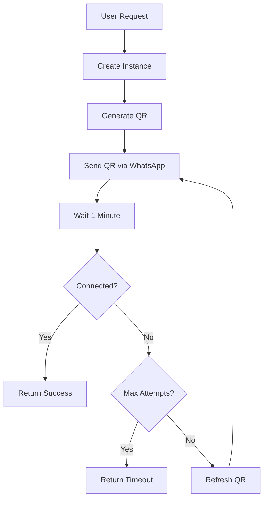

# UAZAPI n8n Workflow - WhatsApp QR Code Automation

[](https://opensource.org/licenses/MIT)
[](https://n8n.io)
[](https://uazapi.com)

Automated WhatsApp instance creation and QR code delivery system using n8n and UAZAPI.

## 🚀 Quick Start

### 1. Import to n8n

**Choose the right workflow file:**

| File | Description | Use When |
|------|-------------|----------|
| `n8n_workflow_simple.json` | ⭐ **Start here** - Simple 4-node workflow | Testing or learning |
| `n8n_workflow_qr_sender_v2.json` | Full auto-loop workflow (compatible) | Production use |
| `n8n_workflow_qr_sender.json` | Original (may have issues) | n8n latest version |

**Import steps:**
```bash
1. Open n8n
2. Click "+" → "Import from File"
3. Upload: n8n_workflow_simple.json (recommended for first try)
4. Click "Active" toggle
```

**Having import issues?** See [IMPORT_FIX.md](IMPORT_FIX.md) for solutions.

### 2. Configure Your Instance
Update the connected instance token in the workflow:
```javascript
connected_instance_token: "YOUR_CONNECTED_INSTANCE_TOKEN"
```

### 3. Test
```bash
curl -X POST http://your-n8n-url/webhook/create-whatsapp-instance \
  -H "Content-Type: application/json" \
  -d '{"phone": "5511999999999"}'
```

## 📋 What It Does

This workflow automatically:
- ✅ Creates new WhatsApp instances
- ✅ Generates QR codes
- ✅ Sends QR codes via WhatsApp (using your connected instance)
- ✅ Monitors connection status every minute
- ✅ Refreshes QR codes automatically
- ✅ Stops when connected or after 10 attempts

## 📂 Files

### n8n Workflows
| File | Description |
|------|-------------|
| `n8n_workflow_simple.json` | ⭐ **Simple workflow** - 4 nodes, easy import |
| `n8n_workflow_qr_sender_v2.json` | Full workflow with auto-loop (compatible) |
| `n8n_workflow_qr_sender.json` | Original workflow (advanced) |

### Documentation
| File | Description |
|------|-------------|
| `README_SUMMARY.md` | Complete overview and quick start |
| `IMPORT_FIX.md` | ⚠️ **Fix import errors** - Troubleshooting guide |
| `WORKFLOW_QUICK_START.md` | Quick setup guide |
| `N8N_WORKFLOW_GUIDE.md` | Detailed node-by-node documentation |
| `UAZAPI_README.md` | Complete API reference |

### Python Scripts
| File | Description |
|------|-------------|
| `uazapi_whatsapp.py` | Python client library |
| `uazapi_client.py` | Advanced client with endpoint discovery |
| `send_qr_via_whatsapp.py` | Manual QR sending example |

## 🔧 How It Works



## 📱 Request Format

**Endpoint:** `POST /webhook/create-whatsapp-instance`

**Body:**
```json
{
  "phone": "5511999999999"
}
```

**Phone Format:**
- ✅ Include country code
- ✅ No "+" sign
- ✅ No spaces or formatting

**Examples:**
- `5511999999999` (Brazil)
- `14155551234` (USA)
- `447911123456` (UK)

## 📊 Response

### Success (Device Connected)
```json
{
  "success": true,
  "message": "Your device has been connected!",
  "instance_id": "r48e075136cf887",
  "status": "connected"
}
```

### Timeout (10 attempts)
```json
{
  "success": false,
  "message": "Maximum attempts reached. QR code expired.",
  "attempts": 10,
  "last_status": "connecting"
}
```

## 🎨 Customization

### Change Wait Time
Edit the **"Wait 1 Minute"** node:
```
amount: 60  // Change to 30, 120, etc.
unit: seconds
```

### Change Max Attempts
Edit the **"Max Attempts Reached?"** node:
```
>= 10  // Change to 5, 20, etc.
```

### Customize QR Message
Edit the **"Send QR via WhatsApp"** node caption:
```javascript
caption: "Your custom message here"
```

## 🛠️ UAZAPI Endpoints Used

| Endpoint | Method | Purpose |
|----------|--------|---------|
| `/instance/create` | POST | Create new instance |
| `/instance/connect` | POST | Get QR code |
| `/instance/status` | GET | Check connection status |
| `/send/media` | POST | Send QR code image |

## 📚 Documentation

- **[README_SUMMARY.md](README_SUMMARY.md)** - Complete overview and quick start
- **[WORKFLOW_QUICK_START.md](WORKFLOW_QUICK_START.md)** - Quick setup guide
- **[N8N_WORKFLOW_GUIDE.md](N8N_WORKFLOW_GUIDE.md)** - Detailed node documentation
- **[UAZAPI_README.md](UAZAPI_README.md)** - Complete API reference

## 🐍 Python Examples

### Basic Usage
```python
from uazapi_whatsapp import UazapiWhatsApp

client = UazapiWhatsApp(
    base_url="https://chatsheros.uazapi.com",
    admin_token="YOUR_ADMIN_TOKEN"
)

# Create instance
result = client.create_instance("my_instance")
instance_token = result['token']

# Connect and get QR
qr_result = client.connect_instance(instance_token)
qr_code = qr_result['instance']['qrcode']

# Save QR code
client.save_qr_code(qr_code, "qr.png")
```

## 🔐 Security

- Store tokens securely (use n8n credentials)
- Validate phone numbers before processing
- Add rate limiting to prevent abuse
- Use HTTPS in production
- Don't expose admin token in logs

## 🐛 Troubleshooting

| Issue | Solution |
|-------|----------|
| "WhatsApp disconnected" | Verify connected instance is active |
| QR not sending | Check phone format (no +, with country code) |
| Workflow not looping | Check "Loop Back" node connections |
| Timeout too fast | Increase max attempts or wait time |

## 📖 Use Cases

1. **Customer Onboarding** - Auto-send QR codes when users sign up
2. **Support Portal** - Provision WhatsApp access on demand
3. **SaaS Integration** - "Connect WhatsApp" button automation
4. **E-commerce** - Seller onboarding with WhatsApp setup

## 🚀 Production Tips

1. Add input validation for phone numbers
2. Set up error notifications (Telegram/Email)
3. Log all attempts to database
4. Implement rate limiting
5. Use environment variables for tokens
6. Monitor workflow execution success rate

## 📄 License

MIT License - feel free to use and modify!

## 🤝 Contributing

Contributions welcome! Please:
1. Fork the repository
2. Create a feature branch
3. Make your changes
4. Submit a pull request

## 📞 Support

For UAZAPI support:
- Documentation: https://docs.uazapi.com
- API Base: https://chatsheros.uazapi.com

For n8n support:
- Documentation: https://docs.n8n.io
- Community: https://community.n8n.io

## ⭐ Star This Repo

If this workflow helped you, please star the repository!

---

**Built with ❤️ using n8n and UAZAPI**

🤖 Generated with [Claude Code](https://claude.com/claude-code)
